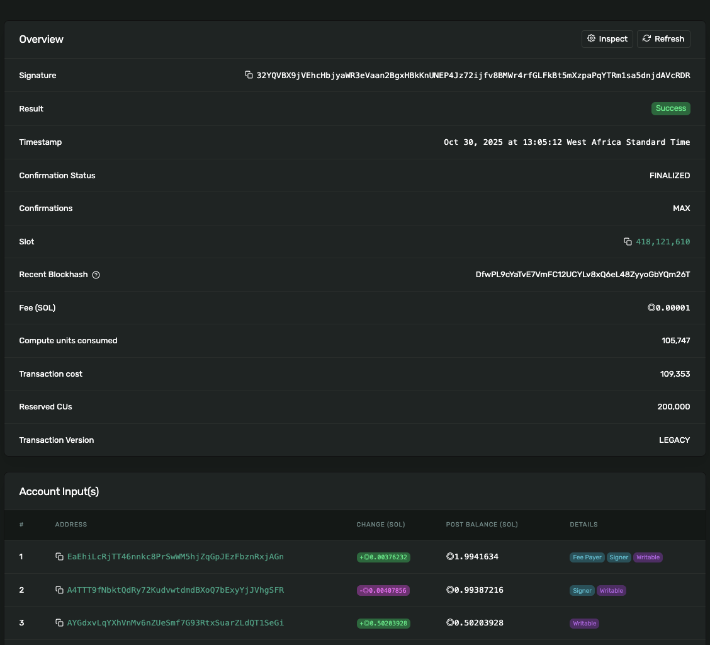

# Themis Escrow Program

A simple, secure escrow program on Solana Devnet for token swaps using associated token accounts (ATAs) and a program-derived address (PDA) vault.

## Overview

This escrow allows a **Maker** to lock DRT tokens in exchange for WSOL from a **Taker**. The trade completes atomically when the Taker accepts the offer.

- **Maker offers**: `X` DRT → expects `Y` WSOL
- **Taker accepts**: sends `Y` WSOL → receives `X` DRT
- All funds held in PDA-controlled vault until completion

---

## Deployment & Key Addresses

| Item                        | Value                                                                                      |
| --------------------------- | ------------------------------------------------------------------------------------------ |
| **Program ID (Deploy Sig)** | `3pfyDqG6t37vYdn8VahB8PXhY9DbBwRBWKbUHoKc2hnkJ6drhRS7fhupgCtwiR7Dwwvc3cxgtxiS2gXKvWEmojnV` |
| **Maker**                   | `EaEhiLcRjTT46nnkc8PrSwWM5hjZqGpJEzFbznRxjAGn`                                             |
| **Taker**                   | `A4TTT9fNbktQdRy72KudvwtdmdBXoQ7bExyYjJVhgSFR`                                             |
| **DRT Token Mint**          | `Fdw8FEek786AZhg4PSSm7nsgHCCu3MsorVhXgMeWZY9a`                                             |
| **WSOL Mint**               | `So11111111111111111111111111111111111111112`                                              |
| **Escrow PDA**              | `HZySj9ufcqcPLfLh7ihzydCvdnyjJiXUTV9jsaPpbKwq`                                             |
| **Vault (PDA ATA for DRT)** | `DmheHkgeLFkqZcW48rDNRjxZVTdEkwfTT3QfFSKpy2SB`                                             |

---

## Associated Token Accounts

| Owner | Token            | ATA                                                                                                                                                                                     |
| ----- | ---------------- | --------------------------------------------------------------------------------------------------------------------------------------------------------------------------------------- |
| Maker | DRT              | `2JSt6fzA42qF81aM7QVyLBm4FriEgUxwkp5UsUFuvqGL`                                                                                                                                          |
| Taker | WSOL             | `CCNE4j7qVgBhXMk9Cb6ydnLAtvkuPDTCUzGu6myFLDsQ`                                                                                                                                          |
| Maker | WSOL             | `AYGdxvLqYXhVnMv6nZUeSmf7G93RtxSuarZLdQT1SeGi`                                                                                                                                          |
| Taker | DRT (post-trade) | [CaVqMAVsHbFSHw6RTQ5HKExMC9HgiMCcgtActg2Wka8W](https://explorer.solana.com/address/CaVqMAVsHbFSHw6RTQ5HKExMC9HgiMCcgtActg2Wka8W?cluster=devnet&customUrl=http%3A%2F%2Flocalhost%3A8899) |

---

## Transaction Flow

### 1. Wrap SOL → WSOL (Taker)

- **Txn Sig**: `4cwgGgdcdjGnFtG2xRWEvSumBexxeUb3z6zbxydZL999b51VT9bpfPHms7GZSNffgeBGreFnb9nYx491v4EeJLTY`
- **Explorer**: [View on Solana Explorer](https://explorer.solana.com/tx/4cwgGgdcdjGnFtG2xRWEvSumBexxeUb3z6zbxydZL999b51VT9bpfPHms7GZSNffgeBGreFnb9nYx491v4EeJLTY?cluster=devnet&customUrl=http%3A%2F%2Flocalhost%3A8899)

### 2. Maker Creates DRT Mint & ATA

- **Mint Txn Sig**: `5PcHZZS98ndQAMQ71a55Ruk6RvTDUMUpJTomP7mAVvvwv1mkkzewWtUhAwuDJWwYR5noK7xBRjvB7gsUQDNAgShf`
- **Explorer**: [View Mint](https://explorer.solana.com/tx/5PcHZZS98ndQAMQ71a55Ruk6RvTDUMUpJTomP7mAVvvwv1mkkzewWtUhAwuDJWwYR5noK7xBRjvB7gsUQDNAgShf?cluster=devnet&customUrl=http%3A%2F%2Flocalhost%3A8899)

### 3. Maker Locks DRT in Escrow

- **Make Offer Txn Sig**: `4xNGv2Y79ScU7FKkf6xrniunWLr6iQvmSXYouQGNsDfhWr2y4xtx1Mqnh4R4v1fGbQMsBvyQvCmQ9hNDQkd6wseb`
- **Explorer**: [View Make Offer](https://explorer.solana.com/tx/4xNGv2Y79ScU7FKkf6xrniunWLr6iQvmSXYouQGNsDfhWr2y4xtx1Mqnh4R4v1fGbQMsBvyQvCmQ9hNDQkd6wseb?cluster=devnet&customUrl=http%3A%2F%2Flocalhost%3A8899)

### 4. Taker Accepts Offer → Escrow Completes

- **Take Offer Txn Sig**: `32YQVBX9jVEhcHbjyaWR3eVaan2BgxHBkKnUNEP4Jz72ijfv8BMWr4rfGLFkBt5mXzpaPqYTRm1sa5dnjdAVcRDR`
- **Explorer**: [View Take Offer](https://explorer.solana.com/tx/32YQVBX9jVEhcHbjyaWR3eVaan2BgxHBkKnUNEP4Jz72ijfv8BMWr4rfGLFkBt5mXzpaPqYTRm1sa5dnjdAVcRDR?cluster=devnet)

---

## Screenshot and Hash of Tx Completing the Escrow

> **Transaction Signature (Take Offer - Completion)**:  
> `32YQVBX9jVEhcHbjyaWR3eVaan2BgxHBkKnUNEP4Jz72ijfv8BMWr4rfGLFkBt5mXzpaPqYTRm1sa5dnjdAVcRDR`

  
_Screenshot of the final "Take Offer" transaction confirming DRT → WSOL swap via escrow PDA._

> **Hash**:  
> `32YQVBX9jVEhcHbjyaWR3eVaan2BgxHBkKnUNEP4Jz72ijfv8BMWr4rfGLFkBt5mXzpaPqYTRm1sa5dnjdAVcRDR`

---

## How to Run

```bash
yarn execute
```

This script:

1. Deploys the program (if not already)
2. Initializes the escrow
3. Executes make_offer and take_offer flows

> It only deploys on localhost. For deployment to devnet, run `anchor deploy` first before `yarn execute`. Ensure you're connected to a local validator or devnet with funded wallets.

## Verification Links

- Taker DRT ATA: 
- Taker WSOL ATA: 

---

> **Themis Escrow — Trustless. Atomic. On-chain.**\_
