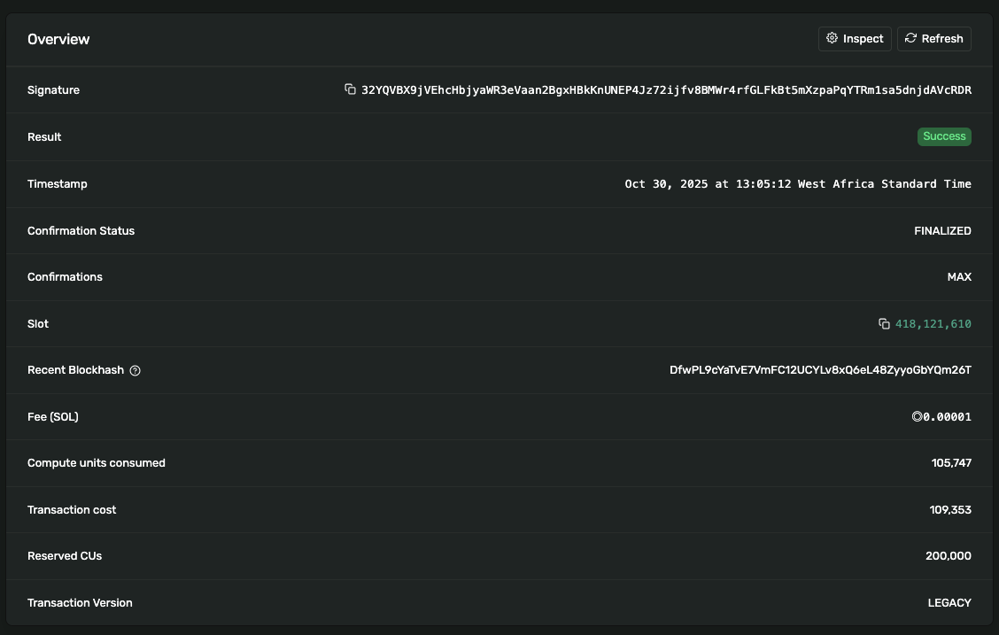

# Themis Escrow

**Themis** is a simple and secure **escrow program** built on the **Solana Devnet**. Named after Themis, the ancient Greek goddess of justice and fairness, it embodies trustless exchange through code rather than intermediaries. Themis allows two parties to **safely swap tokens** without relying on mutual trust — ensuring that either both sides complete the trade or nothing happens at all.

Under the hood, it uses **Program-Derived Addresses (PDAs)** to manage escrow vaults and **Associated Token Accounts (ATAs)** to securely handle token ownership and transfers. Designed for clarity and reliability, Themis serves as a clean, educational example of **Solana-based escrow logic** and **atomic swap mechanisms**.

## Overview

**Themis** facilitates a trustless token-for-token exchange between two parties — a **Maker** and a **Taker** — on the Solana Devnet. The **Maker** initiates an offer by locking a specific amount of tokens (in this case **DRT**) in an escrow vault controlled by a **Program-Derived Address (PDA)**. The **Taker** accepts the offer by depositing the agreed amount of expected tokens (in this case **wrapped SOL (WSOL)**). Once both deposits are made, the program settles the trade **atomically**, ensuring that both transfers occur together or not at all. If no Taker fulfills the offer within a given timeframe or the Maker decides to cancel, the **Maker can safely refund** their locked tokens from the vault.

**An example:**
- **Maker offers:** `X` DRT → expects `Y` WSOL
- **Taker accepts:** sends `Y` WSOL → receives `X` DRT
- **Refund option:** Maker reclaims locked tokens if the offer expires or is canceled
- Funds remain secured in the **PDA vault** until the exchange is completed or refunded.

<!-- ---

## Deployment & Key Addresses

| Item                        | Value                                                                                      |
| --------------------------- | ------------------------------------------------------------------------------------------ |
| **Program ID (Deploy Sig)** | `3pfyDqG6t37vYdn8VahB8PXhY9DbBwRBWKbUHoKc2hnkJ6drhRS7fhupgCtwiR7Dwwvc3cxgtxiS2gXKvWEmojnV` |
| **Maker**                   | `EaEhiLcRjTT46nnkc8PrSwWM5hjZqGpJEzFbznRxjAGn`                                             |
| **Taker**                   | `A4TTT9fNbktQdRy72KudvwtdmdBXoQ7bExyYjJVhgSFR`                                             |
| **DRT Token Mint**          | `Fdw8FEek786AZhg4PSSm7nsgHCCu3MsorVhXgMeWZY9a`                                             |
| **WSOL Mint**               | `So11111111111111111111111111111111111111112`                                              |
| **Escrow PDA**              | `HZySj9ufcqcPLfLh7ihzydCvdnyjJiXUTV9jsaPpbKwq`                                             |
| **Vault (PDA ATA for DRT)** | `DmheHkgeLFkqZcW48rDNRjxZVTdEkwfTT3QfFSKpy2SB`                                             |

---

## Associated Token Accounts

| Owner | Token            | ATA                                                                                                                                                                                     |
| ----- | ---------------- | --------------------------------------------------------------------------------------------------------------------------------------------------------------------------------------- |
| Maker | DRT              | `2JSt6fzA42qF81aM7QVyLBm4FriEgUxwkp5UsUFuvqGL`                                                                                                                                          |
| Taker | WSOL             | `CCNE4j7qVgBhXMk9Cb6ydnLAtvkuPDTCUzGu6myFLDsQ`                                                                                                                                          |
| Maker | WSOL             | `AYGdxvLqYXhVnMv6nZUeSmf7G93RtxSuarZLdQT1SeGi`                                                                                                                                          |
| Taker | DRT (post-trade) | [CaVqMAVsHbFSHw6RTQ5HKExMC9HgiMCcgtActg2Wka8W](https://explorer.solana.com/address/CaVqMAVsHbFSHw6RTQ5HKExMC9HgiMCcgtActg2Wka8W?cluster=devnet&customUrl=http%3A%2F%2Flocalhost%3A8899) |

---

## Transaction Flow

### 1. Wrap SOL → WSOL (Taker)

- **Txn Sig**: `4cwgGgdcdjGnFtG2xRWEvSumBexxeUb3z6zbxydZL999b51VT9bpfPHms7GZSNffgeBGreFnb9nYx491v4EeJLTY`
- **Explorer**: [View on Solana Explorer](https://explorer.solana.com/tx/4cwgGgdcdjGnFtG2xRWEvSumBexxeUb3z6zbxydZL999b51VT9bpfPHms7GZSNffgeBGreFnb9nYx491v4EeJLTY?cluster=devnet&customUrl=http%3A%2F%2Flocalhost%3A8899)

### 2. Maker Creates DRT Mint & ATA

- **Mint Txn Sig**: `5PcHZZS98ndQAMQ71a55Ruk6RvTDUMUpJTomP7mAVvvwv1mkkzewWtUhAwuDJWwYR5noK7xBRjvB7gsUQDNAgShf`
- **Explorer**: [View Mint](https://explorer.solana.com/tx/5PcHZZS98ndQAMQ71a55Ruk6RvTDUMUpJTomP7mAVvvwv1mkkzewWtUhAwuDJWwYR5noK7xBRjvB7gsUQDNAgShf?cluster=devnet&customUrl=http%3A%2F%2Flocalhost%3A8899)

### 3. Maker Locks DRT in Escrow

- **Make Offer Txn Sig**: `4xNGv2Y79ScU7FKkf6xrniunWLr6iQvmSXYouQGNsDfhWr2y4xtx1Mqnh4R4v1fGbQMsBvyQvCmQ9hNDQkd6wseb`
- **Explorer**: [View Make Offer](https://explorer.solana.com/tx/4xNGv2Y79ScU7FKkf6xrniunWLr6iQvmSXYouQGNsDfhWr2y4xtx1Mqnh4R4v1fGbQMsBvyQvCmQ9hNDQkd6wseb?cluster=devnet&customUrl=http%3A%2F%2Flocalhost%3A8899)

### 4. Taker Accepts Offer → Escrow Completes

- **Take Offer Txn Sig**: `32YQVBX9jVEhcHbjyaWR3eVaan2BgxHBkKnUNEP4Jz72ijfv8BMWr4rfGLFkBt5mXzpaPqYTRm1sa5dnjdAVcRDR`
- **Explorer**: [View Take Offer](https://explorer.solana.com/tx/32YQVBX9jVEhcHbjyaWR3eVaan2BgxHBkKnUNEP4Jz72ijfv8BMWr4rfGLFkBt5mXzpaPqYTRm1sa5dnjdAVcRDR?cluster=devnet)

--- -->

## Escrow Completion Screenshot and Hash

  
_Screenshot of the successful **"Take Offer"** transaction showing the atomic DRT ↔ WSOL swap executed through the escrow PDA._

  
_Screenshot of post-transaction token balances verifying that the **Maker** received WSOL and the **Taker** received DRT after escrow completion._

> **Transaction Hash of Take Offer (Escrow Completion)**:  
> `32YQVBX9jVEhcHbjyaWR3eVaan2BgxHBkKnUNEP4Jz72ijfv8BMWr4rfGLFkBt5mXzpaPqYTRm1sa5dnjdAVcRDR`

[View transaction on Solana xplorer](https://explorer.solana.com/tx/32YQVBX9jVEhcHbjyaWR3eVaan2BgxHBkKnUNEP4Jz72ijfv8BMWr4rfGLFkBt5mXzpaPqYTRm1sa5dnjdAVcRDR?cluster=devnet)

## Mints and Signatures

### Token Mints

- **DRT Mint** - [Fdw8FEek786AZhg4PSSm7nsgHCCu3MsorVhXgMeWZY9a](https://explorer.solana.com/address/Fdw8FEek786AZhg4PSSm7nsgHCCu3MsorVhXgMeWZY9a?cluster=devnet)
- **WSOL Mint** - [So11111111111111111111111111111111111111112](https://explorer.solana.com/address/So11111111111111111111111111111111111111112?cluster=devnet)

### Signatures

- **Program Deployment** [3pfyDqG6t37vYdn8VahB8PXhY9DbBwRBWKbUHoKc2hnkJ6drhRS7fhupgCtwiR7Dwwvc3cxgtxiS2gXKvWEmojnV](https://explorer.solana.com/tx/3pfyDqG6t37vYdn8VahB8PXhY9DbBwRBWKbUHoKc2hnkJ6drhRS7fhupgCtwiR7Dwwvc3cxgtxiS2gXKvWEmojnV?cluster=devnet)
- **Make Offer (Escrow Initialization)** - [4xNGv2Y79ScU7FKkf6xrniunWLr6iQvmSXYouQGNsDfhWr2y4xtx1Mqnh4R4v1fGbQMsBvyQvCmQ9hNDQkd6wseb](https://explorer.solana.com/tx/4xNGv2Y79ScU7FKkf6xrniunWLr6iQvmSXYouQGNsDfhWr2y4xtx1Mqnh4R4v1fGbQMsBvyQvCmQ9hNDQkd6wseb?cluster=devnet)
- **Take Offer (Escrow Completion)** - [32YQVBX9jVEhcHbjyaWR3eVaan2BgxHBkKnUNEP4Jz72ijfv8BMWr4rfGLFkBt5mXzpaPqYTRm1sa5dnjdAVcRDR](https://explorer.solana.com/tx/32YQVBX9jVEhcHbjyaWR3eVaan2BgxHBkKnUNEP4Jz72ijfv8BMWr4rfGLFkBt5mXzpaPqYTRm1sa5dnjdAVcRDR?cluster=devnet)

## Setup and Usage

1. Clone and install dependencies:

```bash
git clone https://github.com/devwraithe/themis.git
cd themis
yarn install
```

2. Run the escrow program:

```bash
yarn execute
```

## Tests

```bash
anchor test
```

## Deployment

Ensure your environment is configured for Devnet in Anchor.toml:

```toml
[programs.devnet]
themis = "<YOUR_PROGRAM_ID>"

[provider]
cluster = "devnet"
wallet = "~/.config/solana/id.json"
```

> [!IMPORTANT]
> Ensure your local or devnet wallet is funded (via airdrop or manual transfer) before running any transactions.

Set Solana CLI to devnet and deploy the program:

```bash
solana config set --url devnet
anchor deploy
```

> [!CAUTION]
> **Note:** Minting requires the `mint_authority.json` file which is not included in the repository. Running the command above will auto-create a `user_keypair.json` file for you.

## Security

> [!IMPORTANT]
⚠️ **Never commit your `mint_authority.json` and `user_keypair.json` files or share their private keys.**

<!-- ## Verification Links

- Taker DRT ATA: 
- Taker WSOL ATA: 
-->

---

**Themis Escrow — Trustless. Atomic. On-chain.**
